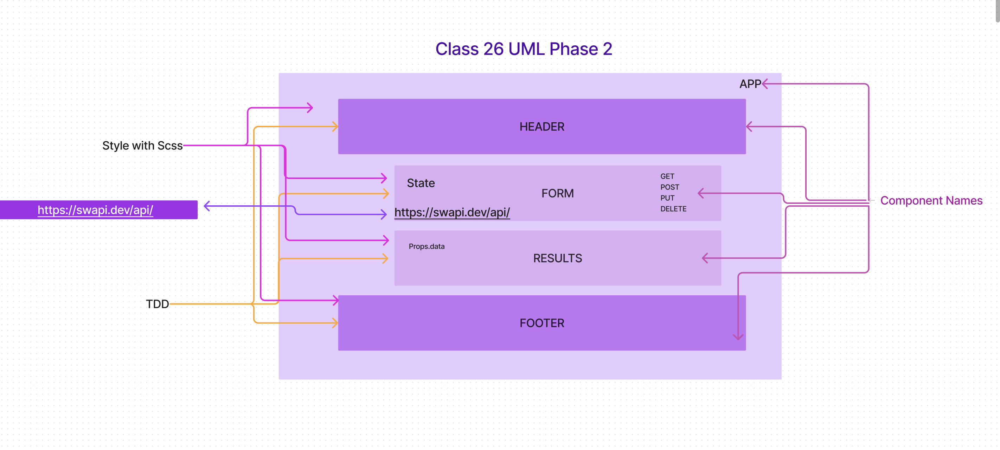
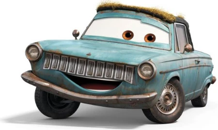

# Resty

## Author: Eva Grace Smith

### RESTy

Our application will be an API testing tool that can be run in any browser, allowing a user to easily interact with APIs in a familiar interface.

### Phase 1: Application Setup

;

In this first phase, our goal is to setup the basic scaffolding of the application, with intent being to add more functionality to the system as we go. This initial build sets up the file structure so that we can progressively build this application in a scalable manner.

### Phase 2: Requirements

In phase 2, we will be receiving user input in preparation of connecting to live APIs, using the useState() hook in our functional components. In order to properly manage state with the useState hook, we will now convert <App /> to a functional component.

The following user stories detail the major functionality for this phase of the project.

* As a user, I want to enter the REST Method and URL to an API.
* As a user, I want to see a summary of my request as well as results returned from an API request in my browser in a readable format.

### Phase 3: State and Props

* Create multiple components to handle each aspect of the Application
* Sharing state and behaviors between components
* Basic layout and styling

### Phase 4: Fit and Finish

Incorporate the spinner, using conditional rendering
App is Fully Tested
App is Fully Documented
RESTy is Deployed and publicly available

### Links

[Deployment: CodeSandbox](https://codesandbox.io/p/github/EvaGraceSmith/resty/main?workspaceId=0f6b3b9a-f258-4570-996a-1c11d92f10b3)

### Collaborators

Ryan Galloway - Instructor
Daniel Frey - TA
Mark Smith - Tutor

